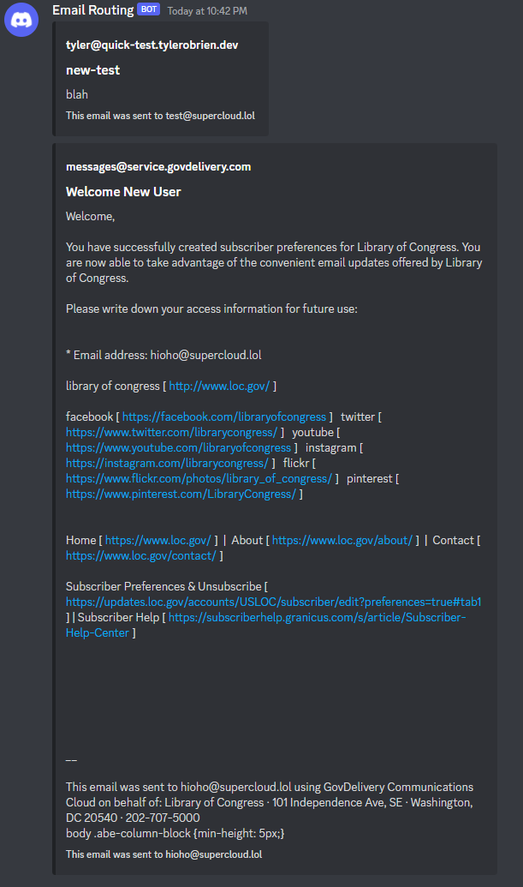

# Cloudflare Worker Emails to Discord
Forward emails you receive to Discord

# AGPL
Note this uses the postal-mime library which is AGPL. It's the only decent browser/working in Cloudflare Workers (not dependent on Node) that I could find. If you can find another one, please let me know!

# How to setup:
Create a webhook to the channel you want your emails in:
https://support.discord.com/hc/en-us/articles/228383668-Intro-to-Webhooks

wrangler secret put DISCORD_WEBHOOK_URL

Your Webhook url, something like

https://discord.com/api/webhooks/1062548905558016052/uz0cLqaJYtcFp78I5WYsBcc1MOQ4AAX1xMDafVAiuJRqp7sQdWhR1dXkvKx0oADFakSA

then deploy, i.e wrangler publish. Create the email routes to the worker within the dashboard as you like.

# Warning:

There is currently no sanity checks with this. If the email parsing goes above the worker's max memory limits of 128MB or takes too much CPU time to parse, it will just fail and throw an error, which Cloudflare currently handles by rejecting the message entirely, i.e  521 5.3.0 Upstream error, please check

# Example of how emails look like in Discord

